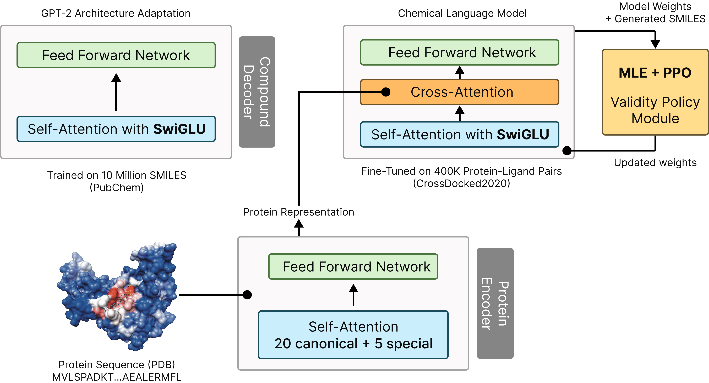

## LoopGen

Transformer-based molecular generator with optional protein conditioning and hybrid MLE + PPO training.

### Architecture

The model is a decoder-only Transformer for autoregressive SMILES generation, optionally conditioned on protein binding-site sequences via cross-attention. A high-level diagram is included below:



### Key features

- **Autoregressive SMILES GPT decoder** with SPE/atomwise/SELFIES tokenization
- **Protein conditioning** via cross-attention (optional)
- **Hybrid training**: MLE (teacher forcing, cross-entropy with label smoothing) + PPO for validity/QED
- **Scheduled sampling** to transition from teacher forcing to model sampling
- **Grammar constraints** (CFG-based) to reduce invalid outputs
- **Evaluation hooks**: validity, uniqueness, QED; periodic sample dumps and JSONL metrics

### Repo structure

- `train.py`: Training entrypoint (single-phase or two-phase with protein conditioning + RL)
- `generate_molecules.py`: Inference script for protein-conditioned generation
- `model/`: Decoder, protein encoder, PPO trainer, grammar, config, scheduled sampling
- `molecule_utils/`: Tokenizers, datasets, augmentation, validation, conversions
- `data/`: Data prep scripts and cached artifacts (see .gitignore)
- `checkpoints/`: Run directories with logs, metrics, and samples (model `.pt` files are ignored)
- `figures/`: Project figures including `Architecture.jpg`

### Data

Data utilities are provided in `data/`:
- `prepare_data.py`, `clean_smiles.py`: SMILES preparation
- `download_crossdock.sh`, `prepare_crossdock.py`, `extract_pockets.py`: protein–ligand pairs

By default, dataset caches, logs, and outputs under `data/` are git-ignored.

### Training pipeline

- **Phase 1: SMILES pretraining**
  - Objective: next-token prediction (MLE) with label smoothing
  - Teacher forcing with scheduled sampling
  - Periodic generation and evaluation (validity/uniqueness/QED)

- **Phase 2: Protein conditioning (optional)**
  - Adds protein encoder + cross-attention into the decoder stack
  - Hybrid loss: `(1 - w) * MLE + w * PPO`, optimizing validity/QED

### Quickstart

1) Install dependencies:

```bash
pip install -r requirements.txt
# RDKit (optional, for property calculation) - see rdkit docs for your platform
```

2) Run SMILES pretraining (Phase 1 only):

```bash
python train.py \
  --data_path data/pubchem/smiles.txt \
  --output_dir checkpoints \
  --model_size standard \
  --num_epochs 10 \
  --batch_size 64 \
  --use_amp
```

3) Two-phase training with protein conditioning + PPO:

```bash
python train.py \
  --data_path data/pubchem/smiles.txt \
  --output_dir checkpoints \
  --enable_multiphase \
  --use_protein_conditioning \
  --protein_ligand_data_path data/output/protein_ligand_training.csv \
  --phase1_epochs 10 \
  --phase2_epochs 15 \
  --use_amp
```

During training, each run stores logs, metrics (`metrics*.jsonl`), and sample generations under a timestamped folder in `checkpoints/`.

### Generation (protein-conditioned)

```bash
python generate_molecules.py \
  --protein_sequence "MKTAYIAKQRQISFVKSHFSRQLE" \
  --checkpoint checkpoints/run_YYYYMMDD_HHMMSS/best_model.pt \
  --vocab checkpoints/vocab.json \
  --num_samples 10
```

If RDKit is installed, the script reports properties (QED, Lipinski, etc.).

### Checkpoints and git

- Only the run directory `checkpoints/run_20251103_035000/` is tracked; all others are ignored.
- All `.pt` files are globally ignored.
- JSONL metrics, logs, and sample text files are tracked for the allowed run.

### License

Research use only unless otherwise stated. See repository for details.